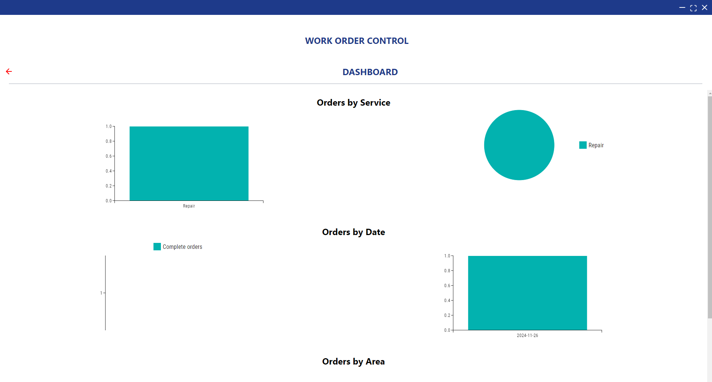
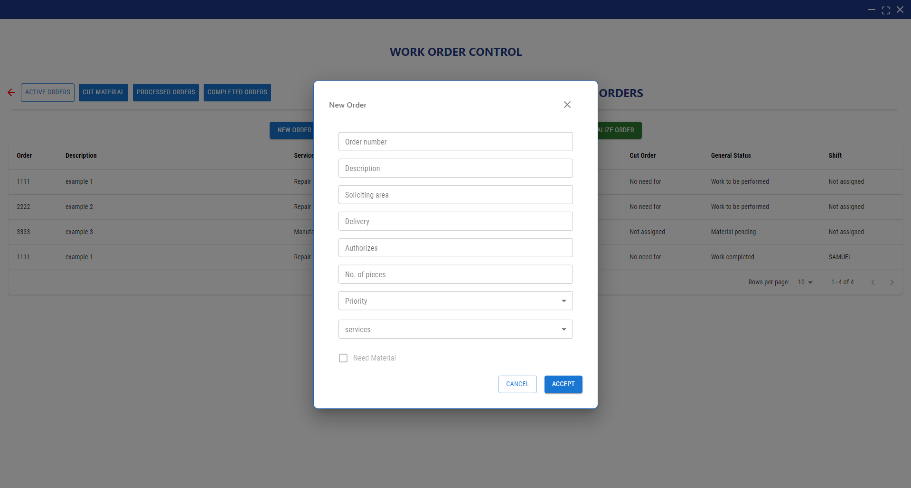
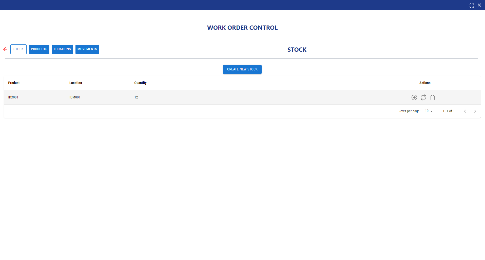

# 📦 Orders Management System


A full-stack desktop application to manage the complete lifecycle of orders — from creation to fulfillment — with analytics, inventory control, and reporting.

## 🚀 Overview

 This system streamlines operational workflows by integrating:

- Order creation and validation
- Production stages (cutting and processing)
- Inventory tracking
- Data visualization dashboards
- Automated PDF reporting
- Custom calculation tools

Built as a portfolio project to demonstrate real-world system design and full-stack development.

## 🖼️ Preview





## 🛠 Tech Stack

**Frontend**

- Electron
- Vite
- React
- Tailwind CSS

**Backend**

- Django REST Framework
- PostgreSQL

**Tools**

- Docker
- ESLint
- Prettier


## ⚙️ Setup

1. **Clone repository**

```bash
git clone https://github.com/joalink/work-order-control-app.git
cd work-order-control-app
```


2. **Backend (Docker)**


```bash
docker-compose up --build
```
First-time setup:

```bash
docker-compose exec backend python manage.py migrate
docker-compose exec backend python manage.py loaddata orders/fixtures/priority.json
docker-compose exec backend python manage.py loaddata orders/fixtures/service.json
docker-compose exec backend python manage.py loaddata orders/fixtures/shifts.json
docker-compose exec backend python manage.py loaddata orders/fixtures/status.json
```


3. **Frontend**

```
cd ./ocw-frontend
npm install
npm run build
```

## 🧭 Features

### 📑 Orders Workflow

- Create and manage orders
- Assign services (cut material or processing)
- Track order status (active / completed)

**Production flow:**

- Create order
- Send to cut material
- Complete cutting
- Send to processing
- Complete processing
- Finalize order
- Generate PDF report

### 📊 Dashboard

- Visual analytics of orders
- Operational insights

### 🧮 Calculator

- Customizable calculation tool
- Adaptable to business needs

### 📦 Inventory

- Product and location management
- Stock creation and updates
- Stock transfers between locations
- Export movements to Excel

## 📁 Project Structure

```bash
orders-system/
├── docker-compose.yml
├── README.md
├── ocw-backend/
│    ├── inventory
│    ├── orders
│    ├── rma_ocw_api
│    ├── Dockerfile
│    ├── entrypoint.sh
│    ├── manage.py
│    └── requirements.txt
│    
└── ocw-frontend/
    └── src
        ├── main
        ├── preload
        └── render
            └── src
                ├── components
                └── pages
                    ├── analytics
                    ├── dashboard
                    ├── inventory
                    ├── orders
                    ├── services
                    ├── utils
                    ├── App.jsx
                    └── main.jsx                    

```

## 👤 Author

JoaLink

## ⭐ Notes
- Built for portfolio purposes
- Focused on real workflow simulation
- Demonstrates full-stack architecture and modular design
