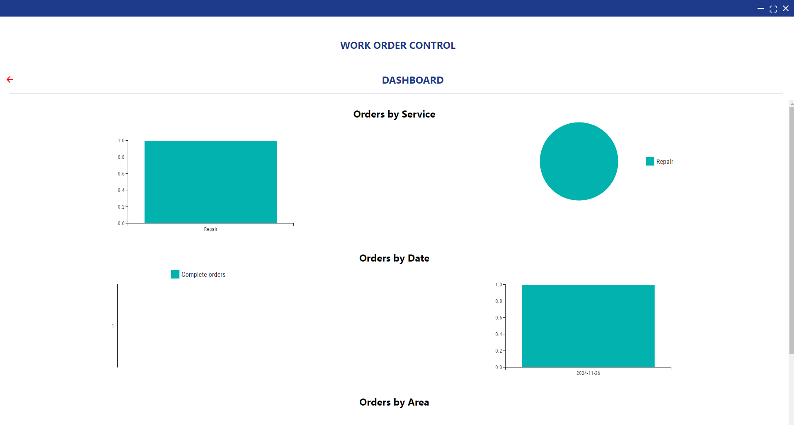

ORDERS SYSTEM APP

The project consists of on a system that manahe the flow of the orders, facilitating the process of order creation, order validation, and order fulfillment. Also add features la dashboard visulization, pdf  report generation, inventory management, anda  acustom calculator for personalization.

Stack
Electron + Vite + React 
Tailwind CSS
Eslint
Prettier
Django Rest Framework
PostgreSQL
Docker

Usage

To usage run the next commands:

BACKEND
Docker compose up --build

--only the first time

docker-compose exec backend python manage.py migrate
docker-compose exec backend python manage.py loaddata orders/fixtures/priority.json
docker-compose exec backend python manage.py loaddata orders/fixtures/service.json
docker-compose exec backend python manage.py loaddata orders/fixtures/shifts.json
docker-compose exec backend python manage.py loaddata orders/fixtures/status.json

FRONTEND

cd .\ocw-frontend\

Then:

npm run build

Operation:

We have 4 sections in the app:

1. Orders
2. Dashboard
3. Calulator
4. Inventory

in orders yo can create orders finished active orders.

When you create an order you can select the service if this will be send to cut material or processed orders (when pass to cut material and finished this will also be send to processed orders).

On cut material you create a new cut order and finished this, also you can check the cuts assigned

then to process orders you can create a new process order and finished this.

then you have to finalize the order

and with this you can download the pdf report

2 - DASHBOARD

here is where you can see the graphics of the orders

3 - CALCULATOR

This is only an extra feature this can be costumized to the needs 

4 - INVENTORY

This is the inventory management, you can see the inventory and the orders that are assigned to the inventory
the steps to geenrate a stock are the following:

1. Create a new product

you can also delete or updata the product data

2. Create a new location

at the same form you can also delete or update the location data

then you have can create a new stock

also you can add, delete stock 

or generate a movements beetween the stocks

in the movements you can dowenload an exel with all the data from de movements

